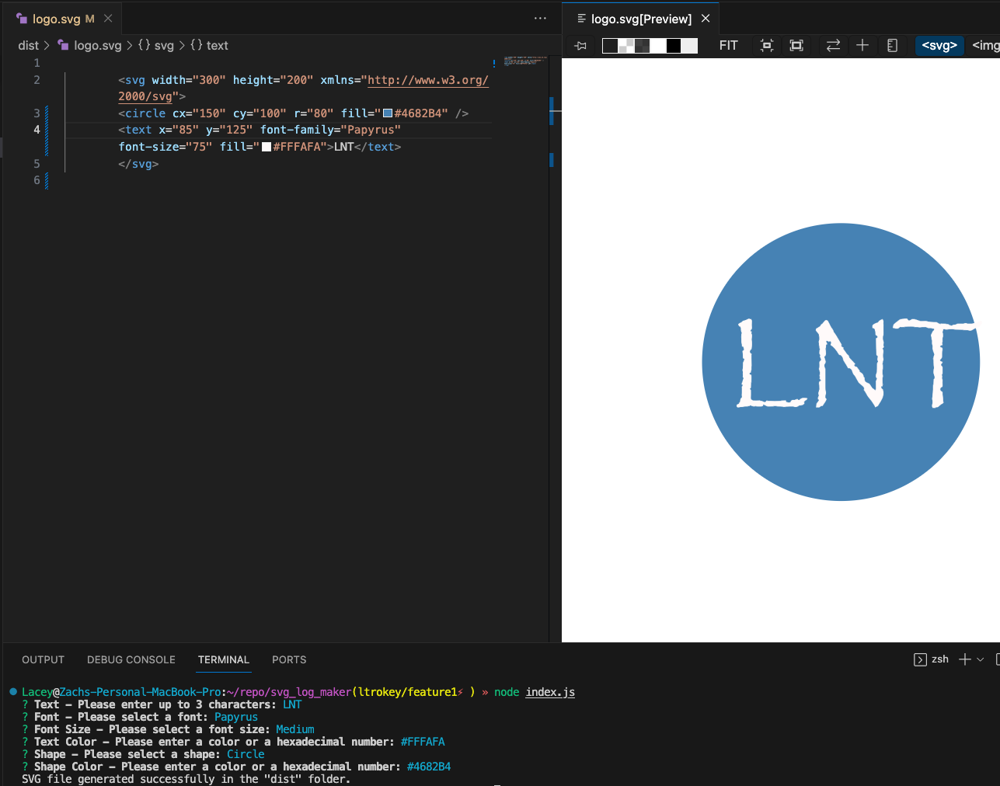
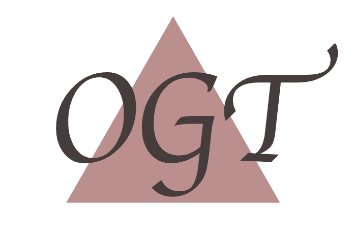
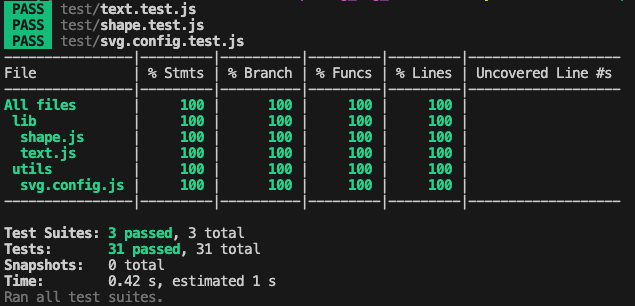

# SVG Simple Logo Maker

[Link to video presentation](https://drive.google.com/file/d/1gea1t19V9IXv2tidsLRxwhtxyBhxUOOX/view)

## Description
The SVG Logo Maker is an a command-line application, providing users with the tools to create customized SVG logo designs. In addition to the essential features of text content, shape selection, and colors, this application offers an array of extra features. Users can explore a range of font styles, including Serif, Sans-serif, Monospace, Cursive, and Papyrus, to give their logos a unique typographic touch. Furthermore, they can fine-tune their designs with different font sizes, from XSmall to XLarge, allowing for precise control over text presentation. With these added capabilities, the SVG Logo Maker delivers a comprehensive solution for crafting logos that suit various styles and preferences, all within an intuitive Node.js environment powered by Inquirer.

## Table of Contents
- [Installation](#installation)
- [Usage](#usage)
- [Badges](#badges)
- [Features](#features)
- [Tests](#tests)
- [Questions](#questions)

## Installation
1. Clone the repository, open your terminal and run the following command `git clone` (repository-url).
3. Navigate to the Project Directory.
4. Install dependencies. Ensure that you have Node.js installed on your machine. If not, download and install it from [Node.js](https://www.nodejs.org).
6. Then, install the project's dependencies using `npm i`.
7. Run the application with the following command `node index.js`.
8. For ease of previewing and editing the SVG file, download the following extension [Jock.svg](https://marketplace.visualstudio.com/items?itemName=jock.svg).

## Usage
1. Install and run the application (see [Installation](#installation) for additional information).
2. Follow the On-Screen Prompts:

The application will present you with a series of prompts to customize your SVG logo. Respond to each prompt by typing in the requested information or selecting one an option.

    Text: Enter the text content for your logo (up to 3 characters).

    Font: Select a font style for your text (e.g., Serif, Sans-serif, Monospace, Cursive, Papyrus).

    Font Size: Choose a font size from the available options (e.g., XSmall, Small, Medium, Large, XLarge).

    Text Color: Specify a color for your text, either by name (e.g., "Red") or as a hexadecimal number (e.g., "#FF0000").

    Shape: Select a shape for your logo (e.g., Triangle, Circle, Square).

    Shape Color: Specify a color for your text, either by name (e.g., "Red") or as a hexadecimal number (e.g., "#FF0000").

3. Once all the questions are answered, the application will generate your customized SVG logo based on your selections. Your generated SVG logo will be saved in the project's `dist` folder as `logo.svg`.

**Examples**:

## Badges

## Features

**Text Customization**: Users can specify the text content for their logo, with a limit of up to 3 characters.

**Font Selection**: The application provides a choice of font styles, including Serif, Sans-serif, Monospace, Cursive, and Papyrus.

**Font Size Options**: Users can choose from a range of font sizes, allowing precise control over text presentation. Options include XSmall, Small, Medium, Large, and XLarge.

**Color Customization**: The application allows users to define colors for both the text and the chosen shape. Users can input colors by name (e.g., "Red") or as hexadecimal numbers (e.g., "#FF0000").

**Shape Selection**: Users can select from three basic shapes for their logo: Triangle, Circle, or Square.

**Error Handling**: The application validates user inputs at each step of the logo creation process. It checks for issues such as empty inputs and invalid text length. When errors occur, the application displays clear and informative error messages that help users understand what went wrong and how to resolve the issue.

**Node.js**:
The application is built using Node.js, making it accessible and versatile for different platforms.

## Tests
The test suite, built with Jest, covers critical components of the codebase, ensuring that each module and class performs as expected. Whether validating the functionality of the Shape and Text classes or verifying the correctness of the SVG configuration, Jest provides a dependable testing framework. These tests not only validate the application's core functionality but also contribute to its stability and error handling, enhancing the overall user experience.

**Test Coverage**:

## Questions
[GitHub Profile](https://github.com/ltrokey)

Please feel free to contact me via the email link below.

[Email](mailto:trokeyln@gmail.com)
